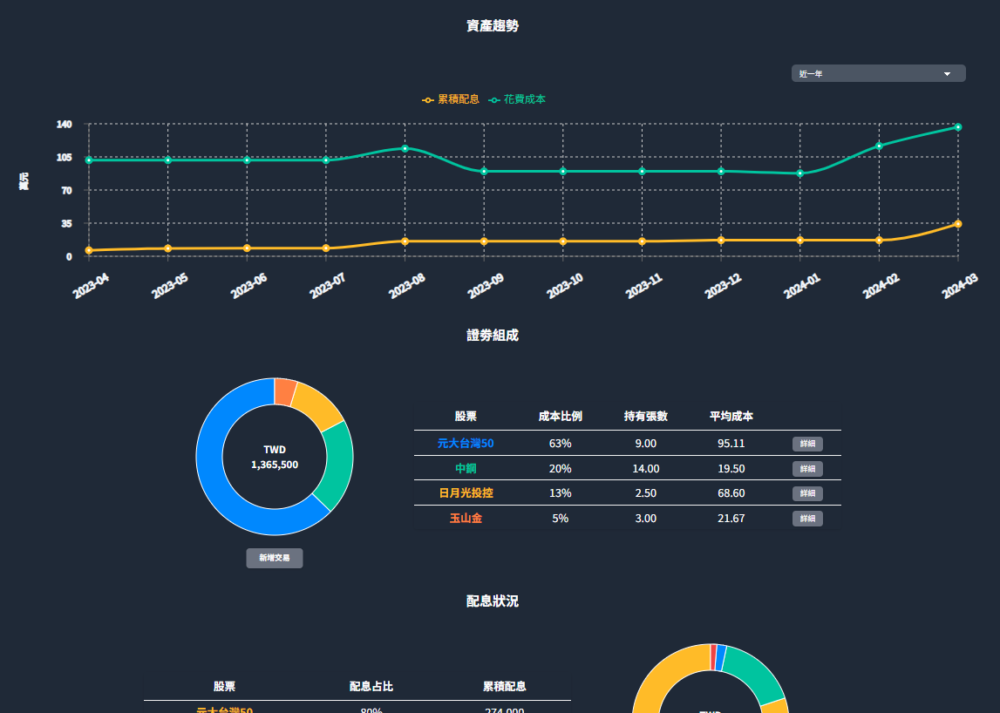

# 投資存股計畫

大量使用第三方圖表資料庫，搭配 React 框架及 TailwindCss 所打造出的前後端分離專案。使用者可以在註冊新帳號之後，登入使用服務。

- 主頁為一資產總覽頁面，使用者能看到目前配息與成本的趨勢圖、目前持有的股票組成、及以實現損益的正負比例。
  

- 使用者需要自己新增交易紀錄及配息紀錄
  
- 表單設有防呆功能，模仿市面上的股票 App，選取買進或賣出時整個頁面會變成相應的紅/綠色，避免使用者填入錯誤資料。  
  
- 待新增功能: 串接第三方帳號登入(Facebook/Google)、新增即時看盤頁面

* DEMO 影片: https://youtu.be/EfK9WMvS4g8

- 前端 GitHub: https://github.com/fishiryoma/stockApp
- 後端 GitHub: https://github.com/JerryWang0122/Stock-Project

## 目次

- [功能介紹](#功能介紹)
  * [DaisyUI, TailwindCss, Recharts 三方搭配構成畫面](#功能介紹)
  * [React-route-dom](#react-route-dom)
  * [Axios](#axios)
  * [React](#react)
  * [其他輔助 Library](#其他輔助-library)
- [學習過程](#學習過程)
  * [專案初期](#專案初期)
  * [專案中期](#專案中期)
  * [專案後期](#專案後期)
  * [心得](#心得)
  
## 功能介紹

### DaisyUI, TailwindCss, Recharts 三方搭配構成畫面

股利跟資產的呈現，利用 Recharts 圖表功能，快速製作大量的生動圖表；搭配 DaisyUI，引入 dropdown、modal 等元件；CSS 利用 Tailwind，有極大的客製化彈性，

### React-route-dom

利用 React-route-dom 達到網頁切換效果。使用 BrowserRouter 建立 Route，並利用 Outlet 功能讓重複的元件不需要被重複撰寫，只需注重在 Outlet 內容的抽換即可。

### Axios

使用 Axios 向 API 獲取資料。利用 axios.create 功能建立可重複使用的 instance，並利用 request interceptor 功能加入 Authorization，以方便後續管理網頁能一鍵修改。在錯誤處理上，catch 裡使用 throw new Error ，能有效的提示使用者及開發者。

### React

熟用 useState、useEffect。正確把握 React 從渲染開始到 useEffect 的執行順序。利用 useCallback 維持正確資料流，遵守 useEffect dependency。利用 useRef 操控 DOM 減少不必要的渲染、使用 error boundary 避免網頁在跳錯時顯示白頁。

### 其他輔助 Library

使用 sweetalert2 套件，有效率快速做出客製化彈出式提示視窗。Tailwind-merge 提高元件的重複利用性，像是 button 元件可以在每次使用時額外添加別的 className。

## 學習過程

### 專案初期

1. 與後端夥伴一邊摸索一邊前進，初期沒有設定出明確的 User Story 跟設計稿，導致中途花費很多時間重新更改或新增功能、版面的樣式也重覆修改多次。深刻體會到即使是小型專案，也要在開工前先制定出規格，才有利於多人合作。

### 專案中期

1. Recharts 官方文件的研讀花費了最多時間。因為此專案同時使用了折線圖、圓餅圖跟長條圖，在樣式的修改，以及官方本身提供了什麼樣的功能，都需要藉由研讀官方文件獲取資訊。
2. 有了其他專案的經驗，本次在過程中，針對元件命名，是否需要 RWD 設計等細節都有注意到，減少重複刪改的次數與時間。

### 專案後期

1. 嘗試提升 code 可讀性。做進一步的元件拆分。

### 心得

由於有先前專案的經驗，本次專案除了第三方官方文件的研讀特別耗費時間之外，網頁的架構、React 的熟悉度也更勝過去，撰寫的速度有明顯的提升。

## 安裝與下載

下載檔案至本地資料夾

```
git clone https://github.com/fishiryoma/stockApp
```

開啟專案資料夾後安裝檔案

```
npm install
```

輸入執行碼

```
npm run dev
```

於瀏覽器輸入以下網址

```
http://127.0.0.1:4000/
```

## 使用工具與版本

- Node.js v16
- React v18
- Vite v5
- Axios v1
- TailwindCss v3
- DaisyUI v4
- React-router-dom v6
- React-error-boundary v4
- Recharts v2
- Js-cookie v3
- Tailwind-merge v2
- Sweetalert2 v11
